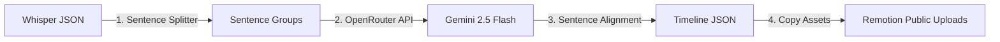

# 🔌 Backend API & Services

The Python backend is responsible for file management, orchestrating transcription pipelines, executing the visual director LLM logic, and invoking rendering engines.

---

## 📂 Key Source Files
- **[app.py](file:///c:/Work%20Stuf/Prototypes/free_course_video_editor_v2/app.py)**: Flask-based Web API server supporting cross-origin resource sharing (CORS).
- **[process.py](file:///c:/Work%20Stuf/Prototypes/free_course_video_editor_v2/process.py)**: CLI script designed for end-to-end processing of local video files.
- **[timeline_service.py](file:///c:/Work%20Stuf/Prototypes/free_course_video_editor_v2/timeline_service.py)**: Shared business logic that coordinates transcript sentence grouping, OpenRouter calls, and timeline adjustments.

---

## 🌐 API Route Specifications

| Method | Endpoint | Description | Payload Constraints / Schema |
| :--- | :--- | :--- | :--- |
| **POST** | `/api/upload` | Saves raw audio or video to the upload directory. | Multipart Form: `file` |
| **POST** | `/api/transcribe` | Transcribes the file using Whisper (Native Modal SDK, HTTP, or Local fallback). | JSON: `{"filename": "...", "model_size": "base"}` |
| **POST** | `/api/analyze` | Groups transcripts into sentences and calls the OpenRouter Gemini API to match layouts. | JSON: `{"filename": "..."}` |
| **POST** | `/api/render` | Spawns parallel Cloud Run, Modal, or local CLI rendering. | JSON: `{"filename": "..."}` |
| **GET** | `/api/projects` | Scans uploads and returns all projects status. | None |
| **GET** | `/api/timeline/<id>`| Fetches timeline configurations for a project. | None |

---

## 🧠 AI Timeline Orchestrator (`timeline_service.py`)

The timeline service maps what is spoken to appropriate visual cards using a structured prompt template (`prompts/video_director.md`).

### Sentence Splitting Strategy
Whisper returns word-level segments. The backend groups these words into coherent sentences using punctuation marks (`.`, `!`, `?`). This ensures overlays align perfectly with natural spoken breaks.

### Visual Director Call
The prompt defines the constraints of each layout (e.g., word count rules for the `DefinitionCard`). Gemini receives the sentence structures and generates an array of visual chunks containing:
- `template_id`
- `start_sentence_index`
- `end_sentence_index`
- `data` properties tailored to the template

### Timeline Alignment & Sync
The service extracts the timestamps of the start and stop sentences, snaps them to exact frame marks (at 30 FPS), and saves the resulting payload into `timelines/{base_name}.json`. It also overwrites `video/src/timeline.json` to enable live previews in Remotion Studio.

---

## 🔗 Related Notes
- Go back to [[Welcome]] / [[System Architecture]].
- Read [[Cloud Parallel Rendering]] to see how rendering scales.
- Read [[Visual Layout Templates]] to view the input schemas and data shapes generated by the LLM.
