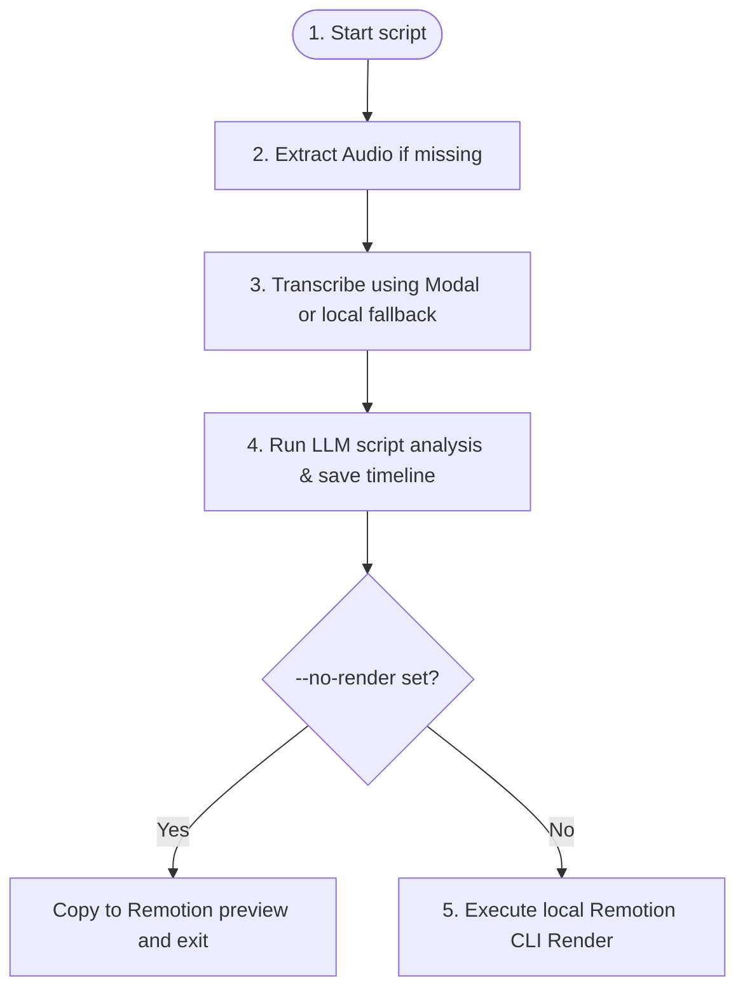

# 🐍 Backend Code: `process.py`

`process.py` is a standalone Command Line Interface (CLI) script that performs local end-to-end processing of educational videos. It allows developers to feed a raw MP4 file into the engine and produce a finished rendered video with overlay templates.

---

## 🛠️ CLI Execution Options

To execute the CLI, pass the absolute or relative path of the source video:
```bash
python process.py /path/to/lecture.mp4
```

### Optional Parameters
- **`--no-render`**: If specified, the script compiles the transcript, executes the visual director LLM, and copies the configurations straight to the Remotion Studio workspace preview at `video/src/timeline.json` but skips the heavy MP4 render. This is ideal for rapid development and interactive layout checks.

---

## 🔍 Internal Processing Flow

When run, the `main()` function coordinates five distinct stages:



### Stage 1: Audio Extraction
Looks for an MP3 file matching the video name in `uploads/`. If it does not exist, triggers `extract_audio_from_video` (which wraps `ffmpeg`) to strip out an audio track.

### Stage 2: Whisper Transcription
Looks for transcription JSON. If it does not exist, calls `transcribe_audio` which queries Modal serverless Whisper functions (or falls back to local `faster-whisper` CPU calculations). The payload is saved to `transcriptions/`.

### Stage 3: LLM Timeline Generation
Calls `process_transcript_to_timeline` from `timeline_service.py` to segment sentences and query Gemini via OpenRouter. The script outputs two files:
1. `timelines/{base_name}.json` (Persisted configuration database)
2. `video/src/timeline.json` (Active preview configuration)

### Stage 4: Remotion Rendering Execution
If rendering is not skipped, the script starts a local CLI call.
To circumvent PowerShell scripting and profile execution restrictions on Windows hosts, `process.py` invokes the shell via `cmd.exe /c`:
```python
cmd = f'cmd.exe /c npx remotion render Showcase "{output_path}" --props="{timeline_file}" --codec=h264 --x264-preset=veryfast --overwrite'
```
It starts the command in a subprocess using `subprocess.Popen` with stdout/stderr pipes, and loops through the stdout stream line-by-line to print real-time rendering statistics onto the developer's console window.

---
- **Next Deep Dive**: [[timeline_service.py]] / [[scheduler.py]]
- **Go Back**: [[Backend API & Services]] / [[Welcome]]
