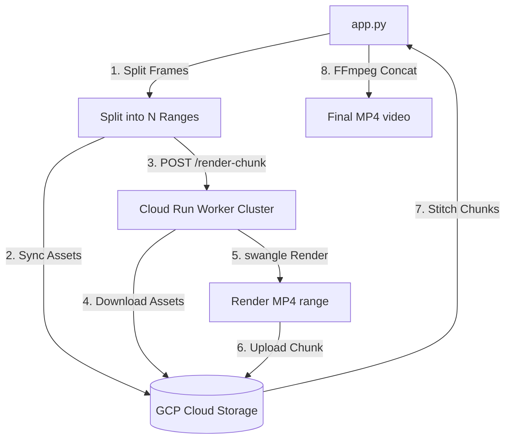

# ⚡ Cloud Parallel Rendering

Video rendering is a CPU/GPU-intensive operation. To achieve fast turnarounds, the system supports parallelized rendering workflows using **Google Cloud Run** and **GCS**, or serverless execution on **Modal**.

---

## ☁️ Google Cloud Run Pipeline Architecture



---

## 🛠️ Step-by-Step execution details

### 1. Asset Syncing to GCS
Before calling the cloud instances, `scheduler.py` uses `upload_if_changed` to push:
- Raw video track (if available) -> `gs://<bucket>/uploads/<name>.[mp4|MP4]`
- Audio track -> `gs://<bucket>/uploads/<name>.mp3`
- Timeline configuration JSON -> `gs://<bucket>/timelines/<name>.json`

If sizes match, files are skipped to conserve bandwidth.

### 2. Impersonated ID Token Authentication
Google Cloud Run endpoints are protected. The scheduler generates a secure JWT ID token using:
- **Pathway 1**: Local Service Account Key file (`GCP_SA_KEY_PATH`).
- **Pathway 2**: Local `gcloud CLI` fallback by executing `gcloud auth print-identity-token --impersonate-service-account=...`.

### 3. Parallel Rendering
The frames of the video are divided into equal-sized ranges. The scheduler initiates a `ThreadPoolExecutor` mapping to parallel HTTP requests hitting `/render-chunk` on Cloud Run.

### 4. Swangle Headless GL Renderer (`worker.py`)
Cloud Run lacks a physical display or GPU. The worker app (`worker.py`) runs the Remotion CLI with `--gl=swangle` (software OpenGL) inside a Docker container:
```bash
npx remotion render Showcase output.mp4 --props=timeline.json --frames=start-end --gl=swangle --for-seamless-aac-concatenation
```

### 5. Stitching & Concatenation
Once all parallel tasks complete, the scheduler:
1. Downloads the chunk files `.mp4` into a temporary server directory.
2. Writes a `concat.txt` configuration.
3. Stitches the video chunks instantly without re-encoding:
   ```bash
   ffmpeg -y -f concat -safe 0 -i concat.txt -c copy output_rendered.mp4
   ```
4. Cleans up temporary GCS chunks.
5. Generates a frame audit comparison report to verify that no frames were dropped.

---

## ☁️ Modal Serverless Option

Alternatively, if `USE_MODAL_RENDER` is set to `true`, the server:
- Connects to a Modal Volume (`video-editor-assets`).
- Syncs timelines and media files.
- Calls `render_composition.remote(base_name)` to leverage serverless GPU nodes.
- Downloads the finished video and audit report back to the server.

---

## 🔗 Related Notes
- Go back to [[Welcome]] / [[System Architecture]].
- Learn about GCP setup configurations in [[Google Cloud Deployment]].
- Learn about the backend routing in [[Backend API & Services]].
- Learn how the frontend Showcase receives props in [[Remotion Frontend Engine]].

