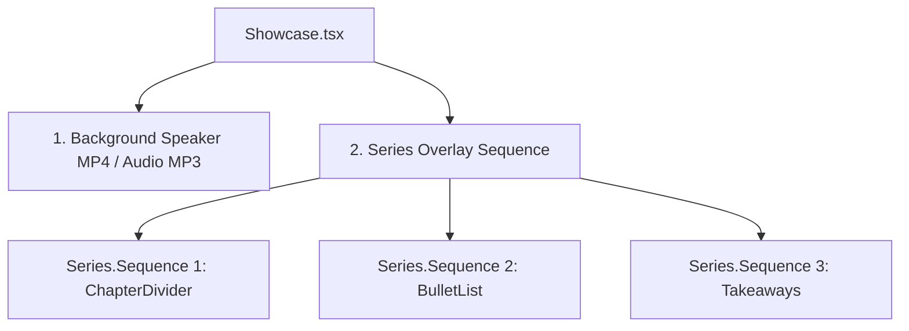

# ⚛️ Remotion Frontend Engine

The frontend is a programmatic React-based video generation engine powered by **Remotion**. It calculates timelines, overlays animations, and maps configuration data to video frames at a constant rate of **30 frames per second (fps)**.

---

## 📂 Core Component Architecture
- **[Root.tsx](file:///c:/Work%20Stuf/Prototypes/free_course_video_editor_v2/video/src/Root.tsx)**: The main entry point of the Remotion bundle. Defines compositions, declares default props, and computes absolute video durations.
- **[Showcase.tsx](file:///c:/Work%20Stuf/Prototypes/free_course_video_editor_v2/video/src/Showcase.tsx)**: The master sequence layout that aligns overlays with the audio/video tracks.

---

## 🎛️ Root Composition Setup (`Root.tsx`)

`Root.tsx` registers all individual templates as independent compositions to enable previewing them inside the Remotion Studio:
```tsx
<Composition
  id="DefinitionCard"
  component={DefinitionCard}
  durationInFrames={105}
  fps={30}
  width={1920}
  height={1080}
  defaultProps={{ data: defaultDefinitionData }}
/>
```

### Dynamic Showcase Duration Resolution
The root registration for the master compilation (`Showcase`) uses a dynamic metadata calculation to compute the exact total frames needed based on the input timeline JSON:
```tsx
calculateMetadata={({ props }) => {
  const resolved = loadTimelineData(props);
  const totalFrames = resolved.timeline.reduce((acc, slide) => acc + (slide.durationInFrames || 0), 0);
  return {
    durationInFrames: totalFrames,
    props: resolved,
  };
}}
```

---

## 🎞️ Showcase Timeline Sequencing (`Showcase.tsx`)

The `Showcase` component orchestrates composition layering:



### Timing Snapping Logic
The function `loadTimelineData` converts seconds into exact frame counts:
$$\text{durationInFrames} = \text{round}((\text{stopTime} - \text{startTime}) \times 30)$$

### Auto-disappear Behavior
For introduction overlays (e.g., `ChapterDivider`, `ConceptCard`, `KeywordCard`), the slide should not remain on the screen for the entire duration of the audio clip. The `Showcase` splits the sequence:
1. **Template duration**: Active rendering for up to 150 frames (5 seconds).
2. **Empty duration**: An empty `div` for the remainder of the segment so the speaker's face is shown clearly.

---

## 🔗 Related Notes
- Go back to [[Welcome]].
- Check [[Visual Layout Templates]] to examine the component details.
- Check [[Design System & Animations]] for styling tokens and animation formulas.
