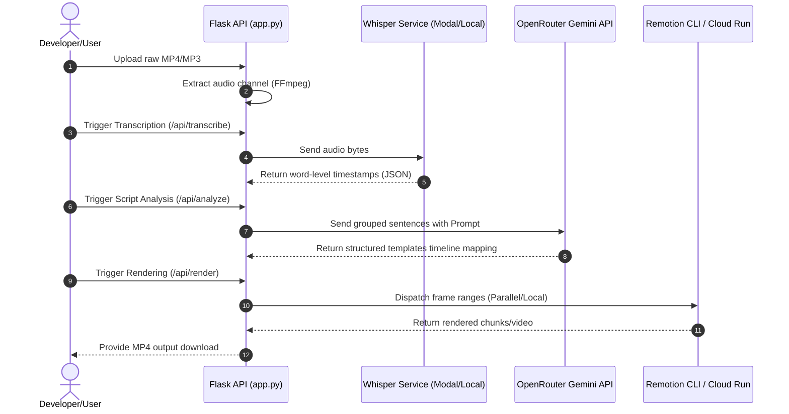

# 🏗️ System Architecture

The **Free Course Video AI Editor** is a programmatic video generation system. It synchronizes UpGrad-branded visual cards (overlays) on top of a speaker's video track based on what the speaker is saying.

The system is split into two primary architectures:
1. **Local Pipeline**: Uses a Flask backend API or CLI script to process audio and render Remotion templates locally.
2. **Cloud/Modal Pipeline**: Scales rendering using parallel instances on GCP Cloud Run or serverless Modal GPU workflows.

---

## 🔄 End-to-End Processing Workflow

---

## 🛠️ Pipeline Configurations

### 1. Local Processing Pipeline
- Optimized for development and testing.
- Uses local `ffmpeg` to extract audio.
- Falls back to local `faster-whisper` (on CPU) if serverless transcribers are unavailable.
- Renders the video locally using the Remotion CLI via `npx remotion render Showcase`.

### 2. Cloud Serverless Pipeline (Modal)
- Uses **Modal** for fast GPU-accelerated Whisper transcription (`whisper-transcribe`).
- Saves local GPU dependencies.
- Can offload video rendering tasks to a remote Modal volume and function cluster.

### 3. High-Speed Parallel Rendering Pipeline (GCP Cloud Run)
- Solves the bottlenecks of single-threaded video rendering by splitting the timeline into multiple segments.
- Renders chunks concurrently on auto-scaling **Google Cloud Run** worker containers.
- Aggregates chunk segments in a GCP Cloud Storage (GCS) bucket.
- Downloads chunks and stitches them seamlessly via `ffmpeg concat` on the server.

---

## 🔗 Related Notes
- See [[Backend API & Services]] for Flask and local script details.
- See [[Cloud Parallel Rendering]] for the mechanics of parallel Cloud Run execution.
- See [[Google Cloud Deployment]] for Docker builds, GCS configurations, IAM policies, and variables setup.
- See [[Remotion Frontend Engine]] to understand how the React components translate to frames.
- See [[Design System & Animations]] for style guidelines and layout rules.

