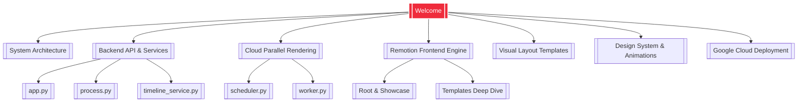

# 🎬 Welcome to the Free Course Video AI Editor Vault

This vault contains the end-to-end documentation for the **Free Course Video AI Editor** codebase. It provides a visual and structured map of the system's architecture, APIs, rendering engine, and templates.

## 🧭 Vault Navigation

### 🗂️ Core Documentation Notes

1. **[[System Architecture]]**: High-level overview of the entire pipeline, from raw video upload to Whisper transcription, LLM timeline planning, and parallel cloud rendering.
2. **[[Backend API & Services]]**: Complete guide to the Flask App (`app.py`), script processor CLI (`process.py`), and the AI timeline service (`timeline_service.py`).
3. **[[Cloud Parallel Rendering]]**: Documentation for the GCP Cloud Run scheduler (`scheduler.py`) and worker (`worker.py`) that render videos up to 10x faster.
4. **[[Google Cloud Deployment]]**: Comprehensive specifications for Docker, artifact building, Cloud Run deployment, GCS bucket setups, IAM policy rules, and configuration variables.
5. **[[Remotion Frontend Engine]]**: Walkthrough of the Remotion setup, including entry props handling in `Root.tsx` and timeline sequencing in `Showcase.tsx`.
6. **[[Visual Layout Templates]]**: Structural specifications and input schemas for all 11 interactive slide overlays.
7. **[[Design System & Animations]]**: Detailed guidelines for typography, UpGrad-branded color tokens, layout constraints, safe areas, and transition animations.

---

### 🔍 Deep Dive References

#### 🐍 Python Backend Code
- **[[app.py]]**: Detailed breakdown of every Flask router API endpoint, upload schema, and local fallback transcription/rendering triggers.
- **[[process.py]]**: Walkthrough of CLI scripting arguments, automatic audio stripping steps, and command executions compatible with Windows hosts.
- **[[timeline_service.py]]**: Analysis of Whisper word punctuation-splitting logic, OpenRouter LLM parsing, and frame timeline snapping boundaries.
- **[[scheduler.py]]**: In-depth review of GCS asset uploading, parallel GCP Cloud Run concurrency, thread management, and video stitching using FFmpeg copy demux.
- **[[worker.py]]**: Execution review of serverless environments including headless chromium configurations, software GL flags (`--gl=swangle`), and Modal cluster volume pipelines.

#### ⚛️ React/Remotion Frontend
- **[[Root & Showcase]]**: Step-by-step description of entry props standardizing adapters, dynamic duration resolvers, and introductory slide auto-disappear sequences.
- **[[Templates Deep Dive]]**: Deep dive into individual React layouts, typography classes, CSS configurations, and slide transitions of all 11 templates.

---
*Tip: Use `Ctrl + Click` (or standard Obsidian navigation) to follow links and explore the system.*