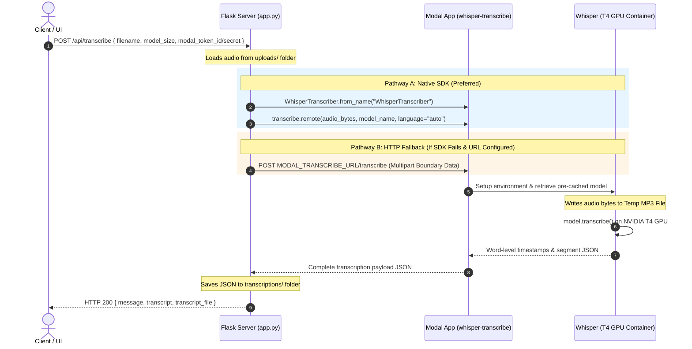

# Serverless Audio Transcription Flow: Flask &rarr; Modal

This document details the end-to-end lifecycle of an audio file as it is sent from the frontend to the Flask application, routed to Modal's GPU servers for Whisper transcription, and returned to the local server database before further processing.

---

## 1. High-Level Architectural Flow

Below is the complete sequence of events from user upload to final JSON transcription storage:



---

## 2. Step-by-Step Processing Lifecycle

### Step 1: Client Ingests Request
The user triggers a request to transcription endpoints at `app.py:531-532` (`/api/transcribe`). The request carries:
- `filename`: Target audio file already uploaded to the Flask server's `uploads/` directory.
- `model_size`: Whisper model parameters (`tiny`, `base`, `small`, `large-v3`).
- Optional Token credentials: `modal_token_id` and `modal_token_secret` to override default system configurations.

### Step 2: Authentication & Routing Determination
The Flask app checks if Modal is enabled. It will forward the request if:
- `USE_MODAL` environment variable is set to `"true"`.
- A fallback URL is supplied in `MODAL_TRANSCRIBE_URL`.

If authentication credentials are provided in the payload, they are injected dynamically into the runtime environment:
```python
if modal_token_id:
    os.environ['MODAL_TOKEN_ID'] = modal_token_id
if modal_token_secret:
    os.environ['MODAL_TOKEN_SECRET'] = modal_token_secret
```

### Step 3: Transcription Execution Pathways
The application attempts three pathways to process the audio, falling back gracefully:

#### **Pathway A: Native Modal Python SDK (Lines 560–583)**
This is the most efficient method. It utilizes the official Modal client SDK to invoke the serverless container directly:
1. Read the audio file binary from disk.
2. Look up the serverless class dynamically via `modal.Cls.from_name("whisper-transcribe", "WhisperTranscriber")`.
3. Call `transcribe.remote(...)` passing the file bytes directly over gRPC.

#### **Pathway B: HTTP Fallback Endpoint (Lines 586–633)**
If the SDK call fails (e.g. library mismatches or local configuration gaps) and `MODAL_TRANSCRIBE_URL` is set, the server falls back to an HTTP endpoint:
1. Construct a manual `multipart/form-data` request with a random UUID boundary.
2. Read raw audio bytes and construct the multipart boundary body payload.
3. Post the binary payload to the remote FastAPI container running on Modal.

#### **Pathway C: Local Fallback (Lines 638–660)**
If Modal server calls fail completely, the Flask server attempts to run transcription locally using `faster-whisper` on local CPU/GPU hardware (if available).

---

## 3. Serverless Environment Processing (Modal Side)

When a request reaches Modal, the container lifecycle is managed by [transcribe_modal.py](file:///c:/Work%20Stuf/Prototypes/Heading_Matcher_v2/transcribe_modal.py):

### 1. Image Provisioning & Caching
The application is pre-built using a Debian Slim image featuring `ffmpeg`, `faster-whisper`, CUDA dependencies, and a pre-download step (`download_models_fn`):
```python
image = (
    modal.Image.debian_slim(python_version="3.10")
    .apt_install("ffmpeg")
    .pip_install("faster-whisper==1.0.3", ...)
    .run_function(download_models_fn) # Caches all model sizes
)
```
*Note: This ensures container start-up times (cold starts) are near-zero because the model weights are stored in the container layers.*

### 2. Container Setup & GPU Execution
The container is configured to launch with an **NVIDIA T4 GPU** and auto-scales:
- `min_containers=0` (scales to zero when idle to prevent costs).
- `timeout=600` (max duration of 10 minutes).
- `scaledown_window=30` (shuts down after 30 seconds of inactivity).

Upon receiving a request, the `setup()` lifecycle method hooks in to store loaded models. Then:
1. The remote `transcribe(audio_bytes, model_name, language)` method is triggered.
2. It writes the bytes to a local `tempfile` (`/tmp/*.mp3`).
3. Calls the C++ optimized `faster_whisper.WhisperModel` inside CUDA (with `compute_type="float16"` precision for maximum inference speed):
```python
segments, info = model.transcribe(
    temp_path,
    beam_size=5,
    word_timestamps=True,
    language=lang_param
)
```

### 3. Payload Construction & Cleanup
The transcriber formats the return JSON structure, parsing every segment and attaching word-level timestamps (`start`, `end`, `word`, `probability`).
Finally, in the `finally` block, it guarantees local temp-file cleanup:
```python
finally:
    if os.path.exists(temp_path):
        os.remove(temp_path)
```

---

## 4. Return to Flask Backend

1. The serialized transcription dictionary arrives back at the Flask server.
2. The server dumps the dictionary to `transcriptions/<filename>.json`.
3. The server replies to the user frontend with `HTTP 200` along with the JSON object.
4. Subsequent processing tasks (e.g. keypoint matches, heading matcher, etc.) load this stored JSON representation directly instead of re-transcribing.
