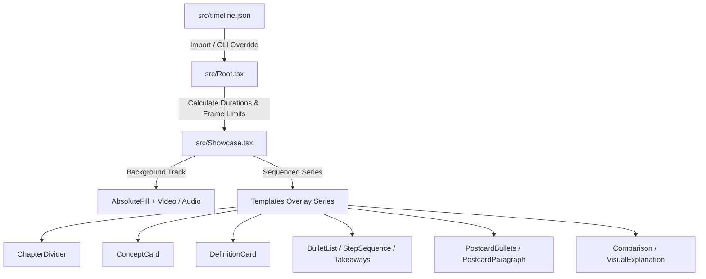

# Technical System Specification: Free Course Video AI Editor

This project is a React-based programmatic video generation engine powered by **Remotion**. It overlays animated lecture cards, templates, and text layouts on top of a speaker's video track in pixel-perfect synchronization.

---

## 1. High-Level Architecture & Flow

The system compiles an MP4 video by combining a background video/audio track with a sequence of layout overlays (slides).



1. **Input Configuration**: All video structure is defined in [timeline.json](file:///c:/Work%20Stuf/Prototypes/Free_Course_Video_AI_Editor/video/src/timeline.json) or supplied via command-line arguments using Remotion's input props overrides.
2. **Timeline Mappings**: The main `Showcase` composition reads the start time and stop time of each overlay (expressed in seconds) and maps it to a frame count at **30 frames per second (fps)**.
3. **Sequencing**: Overlays are rendered sequentially using a Remotion `<Series>` component, in sync with the background speaker track.

---

## 2. Design System & Layout Constraints

All visual layouts conform to a standardized Upgrad-branded design token system defined in [tokens.ts](file:///c:/Work%20Stuf/Prototypes/Free_Course_Video_AI_Editor/video/src/design-system/tokens.ts):

* **Typography**: The Google Font **Lato** is imported globally in [global.css](file:///c:/Work%20Stuf/Prototypes/Free_Course_Video_AI_Editor/video/src/design-system/global.css) and applied to all text components.
* **Brand Color**: **Upgrad Red** is strictly mapped as `rgb(238, 37, 54)` and used as the core focus color.
* **Overlay Mode**: If a background video is present, layouts are rendered in `overlay` mode (with transparent backgrounds so the speaker is visible). If no video is present, they render in `fullscreen` mode with solid, professional backdrops.

### Core Layout Formats

| Layout Format | Dimensions & Coordinates | Visual Design Constraints | Primary Use Case |
| :--- | :--- | :--- | :--- |
| **Full-Screen** | `width: 1920px`, `height: 1080px` | Centered text or high-density grids. Renders with full dark/light solid backdrop in fullscreen, transparent backdrop in overlay. | Chapter introductions, comparison tables, and complex diagrammatic explanations. |
| **Half-Screen** | `width: 960px`, `right: 0`, `top: 0`, `height: 1080px` (Right half of canvas) | Solid **Upgrad Red** panel backdrop, a `10px solid white` left vertical border, and all-white typography. | Displaying bullet lists, step processes, or takeaways side-by-side with active speaker footage. |
| **Corner-Box** | `width: 920px`, `minHeight: 320px`, aligned `right: 120px`, `top: 50%`, `translateY(-50%)` | Solid **Upgrad Red** card backdrop, an `8px solid white` left vertical border, and all-white typography. | Medium-density callouts, highlight key-phrases, or short definitions. |

---

## 3. Global Schema: `timeline.json`

The root JSON structure drives the compilation:

```json
{
  "videoUrl": "uploads/Sample.MP4",
  "audioUrl": "",
  "timeline": [
    {
      "templateId": "TemplateName",
      "startTime": 0,
      "stopTime": 5.2,
      "data": {
        "// template-specific properties go here": ""
      }
    }
  ]
}
```

* **`videoUrl`**: (String) Path to the background MP4 file inside the `public/` folder.
* **`audioUrl`**: (String, Optional) Path to background MP3 audio.
* **`timeline`**: (Array) List of overlay sequences.
  * **`templateId`**: (String) The ID of the overlay component to render.
  * **`startTime`**: (Number) The timestamp in seconds when the overlay should appear.
  * **`stopTime`**: (Number) The timestamp in seconds when the overlay should disappear.
  * **`data`**: (Object) Unique template content fields.

---

## 4. Overlay Templates Directory & Schemas

### 1. `ChapterDivider`
* **Use Case**: Used at the beginning of modules or sections to introduce a new chapter topic. Renders full-screen.
* **Input Schema**:
  ```json
  {
    "templateId": "ChapterDivider",
    "startTime": 0,
    "stopTime": 2.5,
    "data": {
      "module": "MODULE 01",
      "title": "Introduction to Neural Networks"
    }
  }
  ```

### 2. `ConceptCard`
* **Use Case**: To introduce a new key concept. Renders centered full-screen.
* **Input Schema**:
  ```json
  {
    "templateId": "ConceptCard",
    "startTime": 2.5,
    "stopTime": 5.0,
    "data": {
      "concept": "Retrieval-Augmented Generation"
    }
  }
  ```

### 3. `KeywordCard`
* **Use Case**: Highlight a single high-impact technical keyword or acronym. Renders centered full-screen with draw-in line accents.
* **Input Schema**:
  ```json
  {
    "templateId": "KeywordCard",
    "startTime": 5.0,
    "stopTime": 7.0,
    "data": {
      "keyword": "Embeddings"
    }
  }
  ```

### 4. `DefinitionCard`
* **Use Case**: Displays a term and its detailed textual description.
* **Layout Rule**:
  * If definition is **$\le 15$ words**, it automatically renders as a **Corner-Box**.
  * If definition is **$> 15$ words**, it automatically renders as a **Half-Screen** panel.
* **Input Schema**:
  ```json
  {
    "templateId": "DefinitionCard",
    "startTime": 10.0,
    "stopTime": 13.5,
    "data": {
      "term": "Cosine Similarity",
      "definition": "A metric used to measure how similar two vectors are, calculated by finding the cosine of the angle between them in a multi-dimensional space."
    }
  }
  ```

### 5. `BulletList`
* **Use Case**: Displays a header and lists of points.
* **Input Schema**:
  * `"layout"`: Select either `"fullscreen"` or `"halfscreen"`.
  ```json
  {
    "templateId": "BulletList",
    "startTime": 13.5,
    "stopTime": 17.0,
    "data": {
      "title": "Benefits of Vector Embeddings",
      "items": [
        "Captures semantic meaning beyond exact keywords",
        "Enables multi-modal comparison (text, images, audio)",
        "Reduces dimensionality while retaining critical context"
      ],
      "layout": "fullscreen"
    }
  }
  ```

### 6. `StepSequence`
* **Use Case**: Visualizes numbered processes, sequences, or ordered actions.
* **Input Schema**:
  * `"layout"`: Select either `"fullscreen"` or `"halfscreen"`.
  ```json
  {
    "templateId": "StepSequence",
    "startTime": 20.5,
    "stopTime": 25.5,
    "data": {
      "title": "RAG Pipeline Steps",
      "steps": [
        "Parse documents and extract clean text.",
        "Split text into standard chunks with overlap.",
        "Submit chunks to embedding API to generate vectors."
      ],
      "layout": "fullscreen"
    }
  }
  ```

### 7. `ComparisonCard`
* **Use Case**: Used for side-by-side comparison tables. Renders full-screen with alternating background highlight rows.
* **Input Schema**:
  ```json
  {
    "templateId": "ComparisonCard",
    "startTime": 30.0,
    "stopTime": 34.5,
    "data": {
      "title": "Traditional vs Semantic Search",
      "leftTitle": "Traditional Search",
      "rightTitle": "Semantic Search",
      "rows": [
        ["Keyword Matching", "Concept & Context Matching"],
        ["Requires Exact Query Words", "Handles Synonyms & Intent"],
        ["No Multi-modal Support", "Compares Text, Images, and Audio"]
      ]
    }
  }
  ```

### 8. `VisualExplanation`
* **Use Case**: Displays a vertical flow chart/node graph mapping process layouts with a figure caption text. Renders full-screen.
* **Input Schema**:
  ```json
  {
    "templateId": "VisualExplanation",
    "startTime": 34.5,
    "stopTime": 46.16,
    "data": {
      "nodes": [
        "Load Raw PDF Files",
        "Split Into Standard Text Chunks",
        "Generate Semantic Vector Embeddings",
        "Store Chunks In Vector Database"
      ],
      "caption": "Figure 1.1: Document processing pipeline transforming raw text files."
    }
  }
  ```

### 9. `Postcard` (`PostcardBullets` or `PostcardParagraph`)
* **Use Case**: Renders a split card layout with an image/diagram on the left side and text/bullets on the right side.
* **Timing & Resolution**: If the image path is relative (e.g. `"image.png"`), the editor automatically resolves it via `staticFile` so it resolves to the public directory.
* **Input Schema (Bullets Variant)**:
  ```json
  {
    "templateId": "PostcardBullets",
    "startTime": 46.16,
    "stopTime": 50.66,
    "data": {
      "image": "image.png",
      "variant": "bullets",
      "title": "Similarity Matching Process",
      "bullets": [
        "User submits query which is converted into query embedding vector.",
        "Nearest neighbors are computed using cosine distance metric."
      ]
    }
  }
  ```
* **Input Schema (Paragraph Variant)**:
  ```json
  {
    "templateId": "PostcardParagraph",
    "startTime": 50.66,
    "stopTime": 54.66,
    "data": {
      "image": "image.png",
      "variant": "paragraph",
      "title": "Understanding Semantic Search",
      "paragraph": "Semantic search seeks to improve search accuracy by understanding the searcher's intent and the contextual meaning of terms."
    }
  }
  ```

### 10. `Takeaways`
* **Use Case**: A closing summary display showing high-level bullets.
* **Input Schema**:
  * `"layout"`: Select either `"fullscreen"` or `"halfscreen"`.
  ```json
  {
    "templateId": "Takeaways",
    "startTime": 54.66,
    "stopTime": 58.66,
    "data": {
      "title": "Key Takeaways",
      "points": [
        "Retrieval adds external domain-specific context in real-time.",
        "Rich contexts significantly improve prompt completion accuracy."
      ],
      "layout": "fullscreen"
    }
  }
  ```
